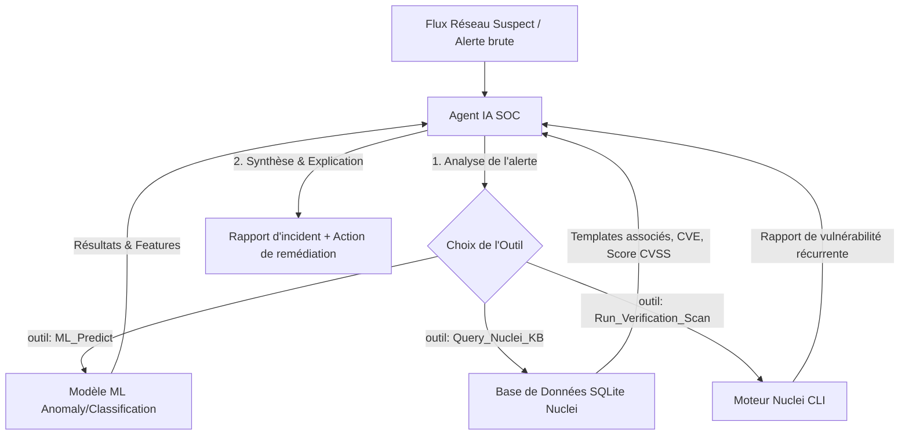

# 🤖 Architecture : Un Agent IA Analyste SOC (SOC Copilot)

L'idée de concevoir un **Agent IA** (basé sur un grand modèle de langage — LLM) qui utilise à la fois ton **modèle de Machine Learning (ML)** et ta **base de connaissances Nuclei** comme outils (*tools*) est excellente et très moderne. C'est le principe d'un **Copilot pour le SOC (Security Operations Center)**.

Voici comment tu peux concevoir et structurer cet agent.

---

## 1. Architecture Générale de l'Agent

L'agent IA agit comme le cerveau central (l'analyste). Il ne se contente pas d'appliquer des règles rigides, il prend des décisions logiques en appelant des outils spécialisés selon la situation.



---

## 2. Les Outils (Tools) de l'Agent IA

Pour que l'agent puisse travailler, tu lui définis des fonctions Python documentées (que le LLM saura appeler de manière autonome) :

### Outil 1 : `model_ml_predict`
*   **Description pour le LLM** : *"Prend en entrée les caractéristiques d'un flux réseau et retourne la probabilité d'attaque ainsi que les caractéristiques réseau qui ont le plus contribué à cette alerte (ex: taille de paquet anormale)."*
*   **Action** : Appelle ton modèle ML (XGBoost, PyTorch, etc.) et extrait les scores de prédiction.

### Outil 2 : `query_nuclei_kb`
*   **Description pour le LLM** : *"Recherche dans la base de connaissances Nuclei si un template ou une signature correspond à un chemin d'accès (URI), un protocole ou un tag spécifique."*
*   **Action** : Exécute une requête SQL sur ta base SQLite [nuclei_kb.db](file:///c:/Users/rarou/Desktop/internship/data/nuclei_kb.db).

### Outil 3 : `run_verification_scan`
*   **Description pour le LLM** : *"Lance un scan de vérification Nuclei ciblé vers un équipement pour confirmer s'il est réellement vulnérable à l'attaque détectée."*
*   **Action** : Exécute la commande Nuclei générée et lit le résultat.

---

## 3. Scénario d'enquête de l'Agent (Exemple concret)

1.  **Déclenchement** : L'IDS détecte une connexion inhabituelle sur le port `8080` ciblant `/api/v1/debug`.
2.  **Raisonnement de l'Agent** :
    *   *« Je reçois une alerte sur le port 8080. Je vais d'abord demander à mon modèle ML d'évaluer ce flux. »*
    *   **Appel Outil** : `model_ml_predict(flow_data)` ➡️ Retour : `Attaque : 94% (Type: RCE, cause principale : taille de requête inhabituelle)`.
    *   *« Le ML suspecte fortement une exécution de code à distance (RCE). Je vais chercher si nous connaissons des vulnérabilités Nuclei associées à l'URI ciblé. »*
    *   **Appel Outil** : `query_nuclei_kb(path="/api/v1/debug")` ➡️ Retour : `Trouvé : template-id: spring-boot-rce (CVE-2022-XXXX, sévérité: critique)`.
    *   *« Une RCE critique Spring Boot correspond exactement à cette URI. Je vais corréler les deux informations. »*
3.  **Restitution de l'Agent** :
    > 🚨 **Diagnostic de l'Agent IA** : 
    > Une alerte RCE a été confirmée à 94% par le modèle de Machine Learning. La corrélation avec la base de connaissances Nuclei montre qu'il s'agit très probablement d'une tentative d'exploitation de la **CVE-2022-XXXX (Spring Boot RCE)** ciblée sur l'URI `/api/v1/debug`. 
    > **Recommandation** : Bloquer immédiatement l'IP source et appliquer le correctif Spring Boot sur le serveur cible.

---

## 4. Le Rôle Précis du LLM dans cet Agent

Le LLM (le grand modèle de langage) sert de **moteur de décision et de traduction**. Contrairement à un script classique séquentiel (`if/else`), le LLM accomplit quatre rôles critiques :

1. **Raisonnement et Sélection d'Outils (Tool Calling)** :
   Le LLM reçoit les descriptions textuelles des outils disponibles (leurs signatures de fonction et docstrings). Lorsqu'une alerte arrive, il analyse la situation et décide lui-même quel outil appeler en premier, avec quels arguments. Si le premier outil renvoie un résultat insuffisant, le LLM rebondit et en choisit un autre.
2. **Corrélation de Contextes Hétérogènes** :
   Le LLM est excellent pour faire le lien entre du quantitatif (les scores de probabilité numérique du modèle ML, les tailles de paquets) et du qualitatif (la description textuelle d'un template YAML de vulnérabilité, les CVEs, les tags de sécurité). Il fusionne ces deux mondes pour en déduire un diagnostic cohérent.
3. **Vulgarisation et Explicabilité (Explainable AI / XAI)** :
   Le modèle ML produit uniquement des chiffres ou des classes brutes (ex: `Score anomalie: 0.98`). Le LLM traduit ce signal abstrait en un langage naturel compréhensible par un humain : *"Le modèle a détecté une anomalie en raison d'une taille de paquet anormale ciblant l'URI X. Cet URI correspond à la vulnérabilité Spring Boot..."*
4. **Prise de Décision et Recommandations** :
   Grâce à sa connaissance générale du domaine informatique et de la sécurité, le LLM peut évaluer le niveau d'urgence d'une remédiation (à partir du score CVSS par exemple) et rédiger des instructions concrètes d'atténuation (ex: *"Appliquer le correctif de sécurité X, ou configurer le pare-feu pour bloquer l'adresse IP Y"*).

---

## 5. Exemple de Code Python (Framework Agentic)

Voici un squelette minimal montrant comment implémenter cet agent avec un framework classique comme **LangChain** ou avec des fonctions Python natives et l'API Gemini :

```python
import sqlite3
from langchain.agents import AgentExecutor, create_openai_tools_agent # ou Gemini
from langchain_core.tools import tool

# ── Définition des Outils pour l'Agent ─────────────────────────────

@tool
def query_nuclei_kb(search_query: str) -> str:
    """Recherche dans la base de connaissances des templates Nuclei par mot-clé, tag ou URI."""
    conn = sqlite3.connect("data/nuclei_kb.db")
    cursor = conn.cursor()
    # Recherche floue dans les tags, le nom ou la description
    cursor.execute("""
        SELECT template_id, name, severity, cve_id, description 
        FROM templates 
        WHERE tags LIKE ? OR name LIKE ? OR description LIKE ?
        LIMIT 3
    """, (f"%{search_query}%", f"%{search_query}%", f"%{search_query}%"))
    rows = cursor.fetchall()
    conn.close()
    if not rows:
        return "Aucun template trouvé pour cette recherche."
    return str(rows)

@tool
def model_ml_predict(packet_size: int, duration: float, protocol: str) -> str:
    """Exécute le modèle de Machine Learning pour prédire si un flux réseau est malveillant ou sain."""
    # Simulation d'appel à ton modèle de détection d'anomalies ML
    # Ici, tu chargerais ton modèle .pkl ou .pt
    anomaly_score = 0.87  # Exemple de score retourné
    if anomaly_score > 0.5:
        return f"Alerte ML : Flux suspect détecté (Score d'anomalie: {anomaly_score:.2f})."
    return "Flux normal détecté par le modèle ML."

# ── Initialisation de l'Agent IA ──────────────────────────────────
# Les outils sont fournis à l'agent
tools = [query_nuclei_kb, model_ml_predict]

# L'agent (LLM) va analyser la requête de sécurité, choisir d'appeler
# model_ml_predict puis corréler avec query_nuclei_kb avant de répondre.
```

---

## 💡 Avantages de cette approche pour ton stage
*   **Explicabilité (XAI)** : Le gros point faible du Machine Learning en sécurité est qu'il dit *"c'est anormal"* sans pouvoir expliquer *pourquoi* ni *ce que c'est*. En reliant le ML à la base Nuclei via l'Agent IA, tu donnes un nom et une explication claire (ex: CVE) à l'anomalie.
*   **Automation intelligente** : L'agent peut prendre l'initiative de lancer un scan de vérification Nuclei pour confirmer si l'alarme est un vrai positif ou un faux positif.
