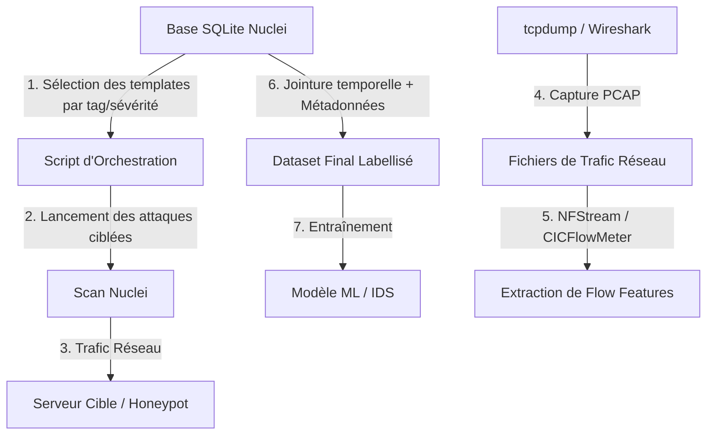

# 🛡️ Exploitation de la Base Nuclei pour un Modèle de Détection d'Attaques ou IDS

Pour intégrer et exploiter cette base de connaissances avec un Système de Détection d'Intrusions (IDS) ou un modèle de Machine Learning de détection d'attaques, tu peux adopter trois approches complémentaires :

---

## 1. Approche Générative : Génération Automatique de Règles IDS (Signatures)

Les IDS traditionnels (comme **Suricata**, **Snort** ou **Zeek**) fonctionnent principalement par signatures (règles). Les templates Nuclei décrivent de manière très structurée la requête d'attaque (méthode HTTP, URL, en-têtes, corps) et la réponse attendue (regex de détection, code statut).

Tu peux créer un script Python qui extrait ces informations de la base SQLite pour **générer automatiquement des règles de détection** :

*   **Extraction** : Lire la base pour identifier les chemins sensibles (`file_path` ou URI spécifiques ciblés par les templates).
*   **Traduction en règle Snort/Suricata** :
    *   *Exemple de template Nuclei* : Requête `GET` sur `/wp-content/plugins/wp-db/readme.txt` cherchant le mot `WP-DB`.
    *   *Règle générée automatiquement* :
        ```text
        alert tcp $EXTERNAL_NET any -> $HTTP_SERVERS any (msg:"Accès suspect au plugin WP-DB (Nuclei)"; flow:established,to_server; content:"GET"; http_method; content:"/wp-content/plugins/wp-db/readme.txt"; http_uri; classtype:web-application-activity; sid:1000001; rev:1;)
        ```

---

## 2. Approche ML Active : Génération de Dataset Labellisé (Honeypot & Emulation)

Pour entraîner un modèle de Machine Learning (supervisé) à détecter des attaques réseau, tu as besoin de trafic d'attaque réel. Tu peux utiliser la base Nuclei comme un **générateur automatique de trafic malveillant** :



### Le protocole d'implémentation :
1.  **Environnement de simulation** : Mets en place un réseau de test avec des serveurs cibles (ou des conteneurs vulnérables volontairement).
2.  **Capture réseau** : Démarre une capture réseau (`tcpdump` ou `Wireshark`) sur les serveurs cibles pour enregistrer le trafic dans des fichiers `.pcap`.
3.  **Lancement des attaques** : Utilise le générateur de commandes Nuclei pour lancer une série de scans ciblés depuis une IP source connue (ex: `192.168.1.50`).
4.  **Extraction de caractéristiques (Features)** : Convertis les fichiers `.pcap` en flux réseau (*network flows*) grâce à des outils comme **NFStream** ou **CICFlowMeter**. Tu obtiendras des caractéristiques numériques :
    *   Nombre de paquets envoyés/reçus.
    *   Tailles moyennes des paquets.
    *   Intervalles de temps entre les paquets (inter-arrival times).
5.  **Labellisation automatique** :
    *   Tout flux provenant de l'IP de scan `192.168.1.50` à l'instant $T$ est étiqueté **"Malicieux"**.
    *   Tu enrichis le label grâce à la base de données : tu sais que le template exécuté à l'instant $T$ possède le tag `rce` ou `sqli`. Ton label n'est plus juste "Malicieux", mais devient spécifique : `Attack_Type = RCE`.
    *   Le trafic d'arrière-plan normal est étiqueté **"Bénin"**.
6.  **Entraînement** : Entraîne ton modèle (ex: Random Forest, XGBoost ou un modèle Deep Learning de type LSTM) à classifier les flux en *Bénin*, *RCE*, *SQLi*, *PortScan*, etc.

---

## 3. Approche ML Passive : Enrichissement de Contexte & Explicabilité (XAI)

Si tu développes un modèle ML d'**analyse d'anomalies non supervisée** (comme un Autoencoder ou un modèle d'Isolation Forest) qui analyse des flux réseau et lève une alerte lorsqu'un comportement s'écarte de la normale :

*   Le modèle de ML détecte une anomalie sur une requête HTTP (ex: une chaîne de caractères inhabituelle ou un chemin bizarre `/api/v2/config`).
*   **Enrichissement instantané** : Au moment où l'alerte est générée, ton système interroge la base SQLite :
    ```sql
    SELECT template_id, severity, cve_id, description 
    FROM templates 
    WHERE file_path LIKE '%/api/v2/config%' OR description LIKE '%/api/v2/config%';
    ```
*   **Explicabilité** : Si un template correspond, l'IDS n'affiche pas seulement *"Anomalie détectée"*, mais affiche :
    > 🔴 **Alerte IDS Critique** : Tentative d'exploitation de la CVE-XXXX (Score CVSS: 9.8). Cette alerte a été corrélée avec le template Nuclei `cve-xxxx-exploit`.

---

## 🚀 Par quoi commencer ?

1.  **Si tu veux du classique (rapide et déterministe)** : Choisis l'**Approche 1** (Traduire les chemins YAML de la base SQLite en règles de détection HTTP pour Suricata).
2.  **Si ton projet porte sur le Machine Learning pur** : Choisis l'**Approche 2**. Génère ton propre jeu de données en exécutant des templates ciblés sur un honeypot, capture le trafic, et labellise-le grâce aux métadonnées (sévérité, tag, type d'attaque) issues de ta base SQLite.
